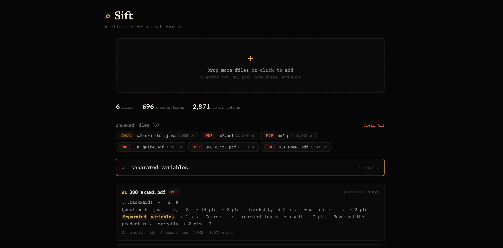

# Sift

A client-side search engine that indexes your files in the browser and ranks results using TF-IDF. No server, no uploads, no accounts — everything runs locally.

**Live demo:** [sift-yourdomain.vercel.app](https://sift-khaki.vercel.app/)



## What It Does

Drag and drop files into the browser and instantly search across all of them:

- **Drag-and-drop indexing** — supports text files, markdown, code files (JS, Python, Java, C, etc.), and PDFs
- **TF-IDF ranked results** — results are scored by relevance, not just keyword matching
- **Highlighted snippets** — shows surrounding context with matched terms highlighted
- **Persistent storage** — indexed files are saved to localStorage so they survive page refreshes
- **File type detection** — recognizes 40+ file extensions with color-coded tags
- **Index statistics** — shows total files, unique terms, and token count

## How the Search Engine Works

### Tokenization
Input text is lowercased, stripped of punctuation, and split into words. Stop words (common words like "the", "and", "is") are filtered out since they don't help distinguish between documents.

### Inverted Index
The core data structure is an inverted index — a map from every unique term to the documents that contain it and how many times. This is the same concept behind large-scale search engines. Built using `Object.create(null)` to avoid JavaScript prototype collisions with terms like "constructor".

### TF-IDF Ranking
Results are ranked using Term Frequency–Inverse Document Frequency:

- **TF (Term Frequency):** How often the search term appears in a document, normalized by document length. A word appearing 10 times in a short document is more significant than 10 times in a long one.
- **IDF (Inverse Document Frequency):** How rare the term is across all documents. Words that appear in every document are less useful for finding specific results.
- **Score = TF × IDF**, summed across all query terms.

### Snippet Extraction
For each result, the engine finds the first occurrence of a matched term and extracts surrounding context. Matched terms are highlighted in the output.

## Technical Details

- **React** with Vite
- **pdfjs-dist** for PDF text extraction
- **localStorage** for persistence (no backend needed)
- **Fully client-side** — your files never leave your browser
- Deployed on **Vercel**

## Run Locally

```bash
git clone https://github.com/lukee-d/sift.git
cd sift
npm install
npm run dev
```

## What I'd Add Next

- **IndexedDB** for larger storage capacity (localStorage caps at ~5MB)
- **Fuzzy matching** so typos still return results
- **Multi-snippet results** showing all matching sections, not just the first
- **Search history** to quickly re-run previous queries
- **Line number references** so you know exactly where in the file the match is